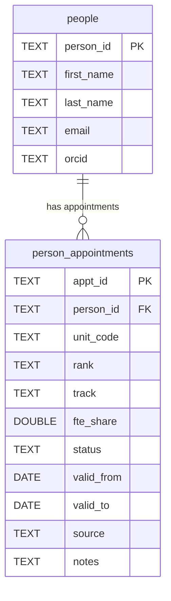

# Harris College Key Performance Indicotors

This project creates and manages a lightweight relational database for tracking
faculty, appointments, and related metrics in Harris College.

---

## 📁 Directory Structure

```
faculty-db/
├─ db/                       # Contains the DuckDB database file (faculty.duckdb)
│  └─ faculty.duckdb
├─ sql/                      # SQL DDL files that define tables and views
│  ├─ 01_people.sql
│  ├─ 02_person_appointments.sql
│  └─ views_01_current_faculty.sql
├─ R/                        # R scripts that create schema and load data
│  ├─ data_01_duckdb_schema.R
│  ├─ data_02_load_people.R
│  └─ data_03_load_faculty_appointments.R
├─ data/                     # CSV data used to populate the database
│  ├─ faculty_people.csv
│  └─ faculty_appointments.csv
└─ README.md                 # Project overview and usage instructions
└─ Experiment.md             # Quarto for used for experimentation
```

## 🧩 Data Model

The Harris College KPIs faculty database is organized around a **core person–appointment structure**:

- **`people`** stores one record per individual (faculty or staff).
- **`person_appointments`** stores one record per appointment, position, or change in role over time.
- A single person can have **multiple appointments** across units or across time (e.g., promotions, transfers, or joint appointments).

### Entity-Relationship Diagram



### Table Overview

| Table | Type | Description |
|--------|------|-------------|
| `people` | Core table | Contains basic identifying information for each person. |
| `person_appointments` | Core table | Contains time-varying details (unit, rank, FTE, status) for each appointment. |
| `v_current_appointments` | View | Filters `person_appointments` to show only current and active appointments. |
| `v_current_faculty` | View | Joins `people` and `v_current_appointments` to show all currently active faculty members. |

This normalized structure keeps historical records of each person’s trajectory within the college and makes it easy to query current status, track promotions, and maintain longitudinal consistency.

---

## 🚀 Getting Started

1. **Open the R Project**
   - Double-click `KPIs.Rproj` or open this folder in RStudio.

2. **Create the database and tables**
   ```r
   source("R/data_01_duckdb_schema.R")
   ```

3. **Load faculty data**
   ```r
   source("R/data_02_load_people.R")
   ```

4. **Load faculty appointments**
   ```r
   source("R/data_03_load_faculty_appointments.R")
   ```

5. **Explore the data**
   ```r
   library(DBI)
   library(duckdb)
   con <- dbConnect(duckdb::duckdb("db/faculty.duckdb"))
   dbGetQuery(con, "SELECT * FROM v_current_faculty LIMIT 10;")
   dbDisconnect(con)
   ```

---

## 🛠️ Development Notes

- Run scripts in numeric order (`data_01_...`, `data_02_...`, etc.).
- The DuckDB file (`db/faculty.duckdb`) is **not** tracked in version control.
- SQL files define database structure; R scripts manage data loading.
- To rebuild the database from scratch, delete `db/faculty.duckdb` and rerun `data_01_duckdb_schema.R`.

---

## ➕ Adding or Updating Data

There are two core data tables in this project:
- **people** – one record per person/faculty
- **person_appointments** – one record per appointment or change in role/unit over time

### 1️⃣ Add or Update Faculty (people)

1. Open or edit the file **`data/faculty_people.csv`**.
   - Each row represents one person.
   - Leave `person_id` blank for new people (the loader script will generate a UUID automatically).
   - Do **not** modify existing `person_id` values — these are permanent keys used in other tables.

2. Save the CSV, then run:
   ```r
   source("R/data_02_load_people.R")
   ```
   This script:
   - Generates UUIDs for new rows
   - Updates changed rows (by replacing matching `person_id`s)
   - Validates required columns (first_name, last_name)

### 2️⃣ Add or Update Appointments

1. Edit **`data/faculty_appointments.csv`**.
   - Each row represents one appointment for a faculty member.
   - The `person_id` must match an existing record in the `people` table.
   - Leave `appt_id` blank for new appointments (a new UUID will be created).
   - Set `valid_to` to a date when the appointment ends, or leave blank if it’s ongoing.

2. Run:
   ```r
   source("R/data_03_load_faculty_appointments.R")
   ```
   This script:
   - Validates that all `person_id` values exist in the `people` table
   - Replaces any existing rows with the same `appt_id`
   - Ensures dates and FTE values are in valid formats

### 3️⃣ Verify Your Changes

After loading, confirm the updates were successful:

```r
library(DBI)
library(duckdb)
con <- dbConnect(duckdb::duckdb("db/faculty.duckdb"))

# Check total faculty and appointments
dbGetQuery(con, "SELECT COUNT(*) AS n_people FROM people;")
dbGetQuery(con, "SELECT COUNT(*) AS n_appointments FROM person_appointments;")

# Preview current active faculty
dbGetQuery(con, "SELECT * FROM v_current_faculty LIMIT 10;")

dbDisconnect(con)
```

---

# Next Steps (Delete)

- Delete this section before pushing to GitHub.
- Create a visual representation of the relationship between the tables in the faculty database.
- Create a simple Shiny app for viewing and loading faculty?
- Start adding other tables we can use to track KPI's (see ClickUp)?
- Push to GH and see if there is a way to automatically create new ClickUp tasks when I create a new GH issue?
