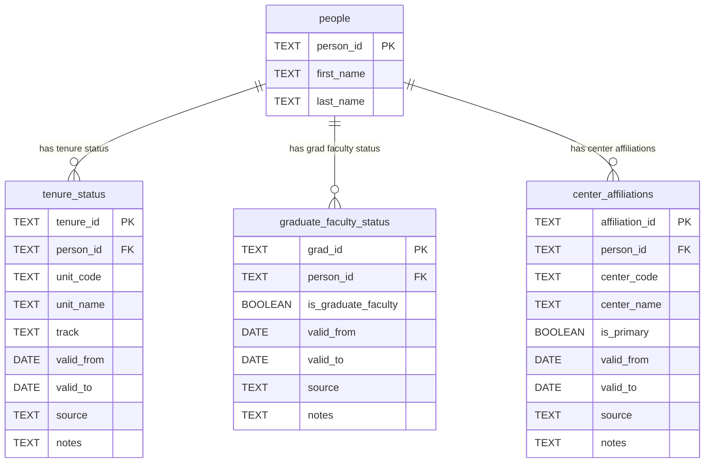

# Harris College Key Performance Indicators

This project creates and manages a lightweight relational database for tracking
faculty status and related metrics in Harris College.

For day-to-day roster updates and common checks, see [GUIDE.md](GUIDE.md).

## 🎯 Purpose

1. Describe Harris College faculty status (e.g., tenure track, graduate status).
2. Monitor research KPIs (e.g., research projects, grant writing, and publishing).
3. Track faculty research interests and facilitate research collaborations.

---

## 📁 Directory Structure

```
HC_KPIs/
├── db/
│   └── faculty.duckdb
├── sql/
│   ├── 01_people.sql
│   ├── 02_tenure_status.sql
│   ├── 03_graduate_faculty_status.sql
│   ├── 04_center_affiliations.sql
│   └── views_01_current_faculty.sql
├── R/
│   ├── data_01_duckdb_schema.R
│   ├── data_02_load_people.R
│   ├── data_03_load_tenure_status.R
│   ├── data_04_load_grad_faculty_status.R
│   └── data_05_load_center_affiliations.R
├── data/
│   └── raw/
│       └── faculty_roster_clean.csv
└── README.md
```

---

## 🧩 Data Model

The database is organized around a **core person–status structure**:

- **`people`** stores one record per individual.
- **`tenure_status`** stores one record per person per unit, with history preserved via `valid_from`/`valid_to` dates. A person with a joint appointment (e.g., KINE and LIINK) will have two rows.
- **`graduate_faculty_status`** stores one record per person, also time-varying.
- **`center_affiliations`** stores one record per person per center affiliation, also time-varying.

### Entity-Relationship Diagram



### Table Overview

| Table                     | Type       | Description                                                               |
| ------------------------- | ---------- | ------------------------------------------------------------------------- |
| `people`                  | Core table | Basic identifying information for each person.                            |
| `tenure_status`           | Core table | Time-varying track and unit for each person. One row per person per unit. |
| `graduate_faculty_status` | Core table | Time-varying graduate faculty standing for each person.                   |
| `center_affiliations`     | Core table | Time-varying center affiliations. One row per person per center.          |
| `v_current_tenure`        | View       | Filters `tenure_status` to active rows only.                              |
| `v_current_grad_faculty`  | View       | Filters `graduate_faculty_status` to active rows only.                    |
| `v_current_center_affiliations` | View | Filters `center_affiliations` to active rows only.                        |
| `v_current_faculty`       | View       | Joins all three tables into a single current faculty roster.              |

### Valid Values

**`track`** (tenure_status):

- `Tenured`
- `Tenure-Track`
- `Professional Practice`

**`unit_code`** (tenure_status):

- APHS, COSD, HCHS, KINE, LIINK, NRAN, NURS, OTD, PA, SOWO

---

## 🚀 Getting Started

1. **Open the R Project**
   - Double-click `KPIs.Rproj` or open this folder in RStudio.

2. **Create the database and tables**

   ```r
   source("R/data_01_duckdb_schema.R")
   ```

3. **Load people**

   ```r
   source("R/data_02_load_people.R")
   ```

4. **Load tenure status**

   ```r
   source("R/data_03_load_tenure_status.R")
   ```

5. **Load graduate faculty status**

   ```r
   source("R/data_04_load_grad_faculty_status.R")
   ```

6. **Load center affiliations**

   ```r
   source("R/data_05_load_center_affiliations.R")
   ```

7. **Explore the data**
   ```r
   library(DBI)
   library(duckdb)
   con <- dbConnect(duckdb::duckdb("db/faculty.duckdb"))
   dbGetQuery(con, "SELECT * FROM v_current_faculty LIMIT 10;")
   dbDisconnect(con)
   ```

> **Always run scripts in order** (`01` → `02` → `03` → `04` → `05`).

---

## ➕ Adding or Updating Data

All data flows from a single source file:

```
data/raw/faculty_roster_clean.csv
```

Expected columns:

| Column                | Description                                     |
| --------------------- | ----------------------------------------------- |
| `given_name`          | First name                                      |
| `last_name`           | Last name                                       |
| `track`               | Tenured, Tenure-Track, or Professional Practice |
| `unit_code`           | Department code (e.g., KINE, NURS)              |
| `unit_name`           | Full department name (optional)                 |
| `is_graduate_faculty` | TRUE or FALSE                                   |
| `center_code`         | Center code or short label (optional)           |
| `center_name`         | Full center name (optional)                     |
| `is_primary`          | TRUE or FALSE (optional, defaults to FALSE)     |

### To update data

1. Edit `data/raw/faculty_roster_clean.csv` with the new or corrected rows.
2. Re-run the relevant loader script(s):
   ```r
   source("R/data_02_load_people.R")
   source("R/data_03_load_tenure_status.R")
   source("R/data_04_load_grad_faculty_status.R")
   source("R/data_05_load_center_affiliations.R")
   ```
3. Verify your changes:
   ```r
   con <- dbConnect(duckdb::duckdb("db/faculty.duckdb"))
   dbGetQuery(con, "SELECT COUNT(*) AS n_people FROM people;")
   dbGetQuery(con, "SELECT * FROM v_current_faculty LIMIT 10;")
   dbDisconnect(con)
   ```

`data_02_load_people.R` is idempotent: rerunning it will not duplicate people.
- Existing person + unchanged data -> no change
- Existing person + changed name formatting/casing -> update
- New person -> insert

### Joint appointments

A faculty member with appointments in two units (e.g., KINE and LIINK) should appear as **two rows** in the CSV with the same name but different `unit_code` values. The loader handles this automatically.

### Center affiliations

Center affiliations are loaded when `center_code` is present in the source CSV. If center columns are not available yet, the center loader exits without changing data.

### Updating a status (e.g., promotion)

To record a change over time rather than overwriting history:

1. Set `valid_to` on the old row to the date the status ended.
2. Add a new row with the updated status and a new `valid_from` date.

---

## 💻 New Computer Setup Checklist

Use this checklist when setting up the project on a different machine.

1. Install prerequisites:
   - `R`
   - `RStudio` (or your preferred IDE)
   - `git`
2. Clone the repository and open the project:
   - `git clone <your-repo-url>`
   - `cd hc_kpis`
   - Open `KPIs.Rproj`
3. Install required R packages:
   ```r
   install.packages(c("DBI", "duckdb", "dplyr", "readr", "stringr", "lubridate"))
   ```
4. Confirm source data exists:
   - `data/raw/faculty_roster_clean.csv`
5. Build the database in order:
   ```r
   source("R/data_01_duckdb_schema.R")
   source("R/data_02_load_people.R")
   source("R/data_03_load_tenure_status.R")
   source("R/data_04_load_grad_faculty_status.R")
   source("R/data_05_load_center_affiliations.R")
   ```
6. Smoke-test the database:
   ```r
   library(DBI)
   library(duckdb)
   con <- dbConnect(duckdb::duckdb("db/faculty.duckdb"))
   dbGetQuery(con, "SELECT COUNT(*) AS n_people FROM people;")
   dbGetQuery(con, "SELECT * FROM v_current_faculty LIMIT 10;")
   dbDisconnect(con)
   ```

---

## Development Notes

- Run scripts in numeric order (`data_01_...`, `data_02_...`, etc.).
- The DuckDB file (`db/faculty.duckdb`) is **not** tracked in version control.
- SQL files define structure; R scripts manage data loading.
- To rebuild the database from scratch, delete `db/faculty.duckdb` and rerun all scripts in order.
- `valid_from` is set to the date the loader script is run (`Sys.Date()`). There is no `valid_from` column in the source CSV.
- If you are using an extension such as DBCode to view `db/faculty.duckdb`, you may need to restart your IDE to see updates, especially after structural database changes.
- `people` enforces normalized-name uniqueness (`trim` + lowercase) to prevent accidental duplicate inserts.
